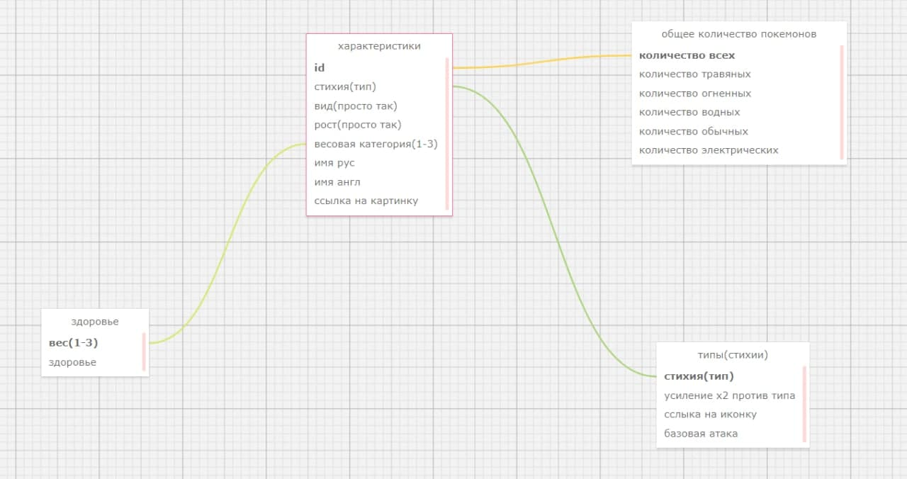

# POCKEMON DATABASE
## Contributors:
**19SE-1**
* ***Pavlova Daria*** 
* ***Khoroshilova Marina***

#### Придумать свою предметную область и продумать схему БД для неё.
	Pockemonss
	TODO: описание таблиц
	
    
​

#### Критерии к БД:
**[1]** БД должна быть в третьей нормальной форме или выше;

*
 
**[2]** Минимальное количество таблиц – две;

* Созданная база данных состоит из 3х таблиц 

**[3]** Все подключения из GUI должны осуществляться выделенным, не root, пользователем;

* 

**[4]** Должен существовать как минимум один индекс, 
    созданный вами по выбранному текстовому не ключевому полю;

* 

**[5]** В одной из таблиц должно присутствовать поле, заполняемое/изменяемое только триггером 
(например, «общая стоимость бронирования» в таблице «бронирования», которое автоматически 
высчитывается при добавлении/изменении/удалении билетов, входящих в это бронирование)

*

#### Реализовать программу GUI со следующим функционалом:
**[1]** Создание базы данных (важно(!) именно create database, а не только create table) 
* 
**[2]** Удаление базы данных  
*
**[3]** Вывод содержимого таблиц  
*
**[4]** Очистка(частичная - одной, и полная - всех) таблиц  
*
**[5]** Добавление новых данных  
*
**[6]** Поиск по заранее выбранному (вами) текстовому не ключевому полю  
*
**[7]** Обновление кортежа  
*
**[8]** Удаление по заранее выбранному текстовому не ключевому полю  
*
**[9]** Удаление конкретной записи, выбранной пользователем  
*
**[10]** Все функции должны быть реализованы как хранимые процедуры. 
* 

#### Демонтрация работы 
